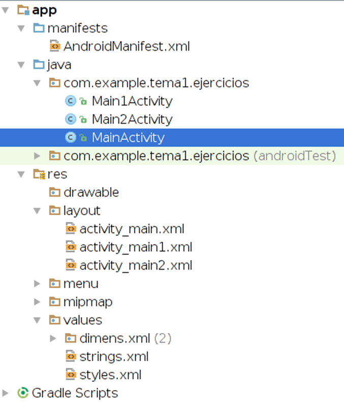
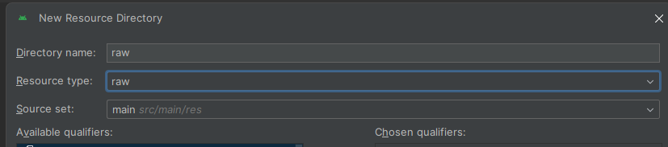
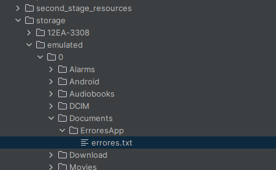

# PMDM4 – MULTIMEDIA

Los ejercicios se realizarán con Android Studio Meerkat.
La actividad principal tendrá varios botones, cada uno de los cuales permitirá lanzar un ejercicio.


---


##  Configuración inicial del proyecto

###  Mínimo SDK

En `build.gradle (Module: app)` establecemos `minSdk 26` porque usamos funciones como animaciones, Glide y ViewFlipper que requieren versiones modernas de Android:

```gradle
android {
    compileSdk 34

    defaultConfig {
        applicationId "com.example.pmdm4_lealramospablo"
        minSdk 26
        targetSdk 34
    }
}
```

---

##  Añadir dependencias (Glide)

En el mismo archivo `build.gradle`, dentro del bloque `dependencies`, añadimos Glide:

```gradle
 implementation(libs.glide)
    annotationProcessor(libs.glide.compiler)
```

Glide nos permite **descargar y mostrar imágenes desde Internet** de forma muy eficiente.

En el archivo `libs.versions.toml`, añadiremos

```
[versions]
glide = "4.16.0"

[libraries]
glide = { group = "com.github.bumptech.glide", name = "glide", version.ref = "glide" }
glide-compiler = { group = "com.github.bumptech.glide", name = "compiler", version.ref = "glide" }

```


---

##  Permisos necesarios

En `AndroidManifest.xml` añadimos:

```xml
<uses-permission android:name="android.permission.INTERNET" />
```

Esto es necesario para que la app pueda acceder a imágenes online.

```xml
 <uses-permission android:name="android.permission.WRITE_EXTERNAL_STORAGE" />
```
Esto es necesario para poder acceder al alamcenaineto externo

---


##  Ejercicio 1 – PAISAJES

Crea una aplicación que permita valorar paisajes de Andalucía.
En la pantalla principal habrá un botón: "Paisajes"; al pulsar sobre dicho botón empezará una animación formada por el texto "Valoración de paisajes” con las letras grandes.
La animación puede ser: mover el texto horizontalmente de izquierda a derecha, hacer que el texto desaparezca o aparezca lentamente, cambiar un texto por otro, hacer que el texto parpadee y luego desaparezca finalmente, hacer zoom sobre el texto sobre el texto (aumentarlo o disminuirlo), etc. Escoge las animaciones que más te gusten, al menos debe haber 2 tipos de animaciones distintas.
Cuando termine la animación anterior, se mostrará una secuencia secuencia de imágenes (al menos 4).
Se deberá hacer con un ViewFlipper o con un AdapterViewFlipper y desplazarse de una a otra imagen deslizando la pantalla con el dedo (o ratón si se ejecuta en un emulador). Además debe existir un cuadro de texto donde se podrá valorar la imagen de 1 a 10.
Los botones y fondos de pantalla deberás diseñarlos con degradados de diferentes colores.
Debes reproducir un sonido al realizar la animación o al pasar de una imagen a otra.

---

Lo primero que hacemos es Cargar el sonido

NO OLVIDAR que este sonido debe ir en la carpeta raw!! (si no existe, como era mi caso, crearlo)




```
 try {
            // sonido= MediaPlayer.create(R.raw.sonido); da error
            sonido = MediaPlayer.create(this, R.raw.desliza);
            if (sonido == null) {
                Log.e("ERROR", "El sonido no se ha cargado. ¿Está el archivo en la carpeta raw?");
            }
        } catch (Exception e) {
            Log.e("ERROR", "Fallo al cargar sonido: " + e.getMessage());
        }

```

Tras esto, cargamos la animacion de "slide"
E iniciamos la varible "Visor" con "False" para que no empiece solo

```
  visor.setInAnimation(this, android.R.anim.slide_in_left);
        visor.setOutAnimation(this, android.R.anim.slide_out_right);

        // Muy importante: si no desactivamos autoStart, cambia solo
        visor.setAutoStart(false);
        visor.setClickable(true);
```

Luego configuramos el gesto de deslizar
De aqui, cabe destacar  que lo que hace es una comparacion en el ejeX. Cuando detecta este cambio en el eje horizontal, es cuando suena el sonido

```
   gestos = new GestureDetector(this, new GestureDetector.SimpleOnGestureListener() {
            @Override
            public boolean onFling(MotionEvent e1, MotionEvent e2, float velX, float velY) {
                Log.d("GESTO", "Desliz detectado");


                if (e1.getX() > e2.getX()) {
                    visor.showNext(); // Deslizar a la izquierda
                    Log.d("GESTO", "Mostrando siguiente imagen");
                } else {
                    visor.showPrevious(); // Deslizar a la derecha
                    Log.d("GESTO", "Mostrando imagen anterior");
                }

                try {
                    sonido.start();
                } catch (Exception ex) {
                    Log.e("ERROR", "Error al reproducir sonido: " + ex.getMessage());
                }

                return true;
            }
        });
```

Por ultimo y para la animacion del texto, lo he hecho en 3 pasos

Paso 1 = de lado a lado

```
 private void animarTextoPaso1() {

        Animation mover = new TranslateAnimation(-500, 500, 0, 0);
        mover.setDuration(1500);
        texto.startAnimation(mover);

        Log.d("ANIMACION", "Paso 1: mover el texto de izquierda a derecha");

        mover.setAnimationListener(new Animation.AnimationListener() {
            @Override
            public void onAnimationStart(Animation animation) {
                // No necesitamos hacer nada al empezar
            }

            @Override
            public void onAnimationEnd(Animation animation) {
                animarTextoPaso2(); // Después del movimiento, vamos al zoom
            }

```
Tras esto, llamamos al PASO 2 = agrandar texto

```
 private void animarTextoPaso2() {

        Animation zoom = new ScaleAnimation(
                1f, 2f, 1f, 2f,
                Animation.RELATIVE_TO_SELF, 0.5f,
                Animation.RELATIVE_TO_SELF, 0.5f
        );
        zoom.setDuration(1500);
        texto.startAnimation(zoom);

        Log.d("ANIMACION", "Paso 2: aplicar zoom al texto");

        zoom.setAnimationListener(new Animation.AnimationListener() {
            @Override
            public void onAnimationStart(Animation animation) {}

            @Override
            public void onAnimationEnd(Animation animation) {
                animarTextoPaso3(); // Y luego desaparece
            }

            @Override
            public void onAnimationRepeat(Animation animation) {}
        });
    }
```
Y como se ve en "onAnimationEnd" llamamos al paso 3 = desvanecer

```
  private void animarTextoPaso3() {
        // AlphaAnimation(0f, 1f)
        Animation desaparecer = new AlphaAnimation(1f, 0f);
        desaparecer.setDuration(1500);
        texto.startAnimation(desaparecer);

        Log.d("ANIMACION", "Paso 3: desvanecer el texto");
    }
```
RESPECTO a LOS LAYOUTS

Se ha creado un boton_gradiente , que se encuentra en la carpeta "Drawable"

```xml
<?xml version="1.0" encoding="utf-8"?>
<shape xmlns:android="http://schemas.android.com/apk/res/android"
    android:shape="rectangle">
    <gradient
        android:angle="90"
        android:startColor="#FF9800"
        android:endColor="#F57C00"/>
    <corners android:radius="15dp"/>
    <padding android:left="10dp" android:right="10dp"/>
</shape>


```

Tambien se ha creado un borde para el editText de valoracion

```xml
<?xml version="1.0" encoding="utf-8"?>
<shape xmlns:android="http://schemas.android.com/apk/res/android"
    android:shape="rectangle">
    <solid android:color="@android:color/transparent"/>
    <stroke android:width="2dp" android:color="#FFFFFF"/>
    <corners android:radius="10dp"/>
    <padding android:left="10dp" android:right="10dp"/>
</shape>
```
Y un fondo gradiente

```xml
<?xml version="1.0" encoding="utf-8"?>
<shape xmlns:android="http://schemas.android.com/apk/res/android"
    android:shape="rectangle">
    <gradient
        android:angle="90"
        android:startColor="#FF9800"
        android:endColor="#F57C00"/>
    <corners android:radius="15dp"/>
    <padding android:left="10dp" android:right="10dp"/>
</shape>
```

---

##  Ejercicio 2 – IMAGENES

Se desea descargar una serie de imágenes cuyas rutas están definidas en un fichero disponible en un servidor propio en Internet. Después se realizará una animación con ellas.
Ejemplo del fichero imagenes.txt situado en un servidor web con las rutas a las imágenes que se desean descargar (situadas un servidor local o en Internet):

https://dam.org.es/ficheros/spaniel.jpg
https://dam.org.es/ficheros/bordercollie.jpg
https://dam.org.es/ficheros/husky.jpg
http://192.168.2.50/imagen/foto.jpg
http://192.168.2.50/noexiste.png
https://dam.org.es/ficheros/goldenretriever.jpg

Se utilizará una biblioteca como Picasso, Glide o Coil (tiene una extensión para Jetpack Compose) para realizar la descarga de las imágenes especificadas en el fichero imagenes.txt.
Una vez descargadas, se realizará una animación con las imágenes obtenidas.
Además, se añadirán al fichero errores.txt (situado en la tarjeta de memoria) los errores que se hayan producido:
•	no se puede descargar el fichero de imágenes
•	no se puede descargar alguna imagen, etc.
Por cada error producido, se añadirá al fichero errores.txt una línea con la ruta al archivo que se quiere descargar, la fecha y hora de acceso y la causa del error (fallo en el servidor web, no existe el fichero, . . . ).


### Métodos principales:

- El for recorre la lista que le hemos pasado
- Por cada linea leaida, llamamos a "Glide", la usamos en la actividad actual (Glide.with(this)), con ".load(url)" le pasamos la URL a cargar (la primera vuelta del for) y con  "into(new CustomTarget<Drawable>())" no cargamos directamente la imagen descargada , sino que creamos una a mano 

Cuando Glide ha conseguido descargar la imagen se ejecuta "onRessourceReady" Que:
    - Crea un ImageView nuevo
    - Le ponemos la imagen descargada
    - Añadimos la imagen al ViewFlipper

Si falla la imagen "onLoadFailed" --> Sale el toast y llama al metodo "guardarError"

```
for ( String url : urlsImagenes) {
            Glide.with(this)
                    .load(url)
                    .into(new CustomTarget<Drawable>() {
                        @Override
                        public void onResourceReady(Drawable drawable, Transition<? super Drawable> transition) {
                            ImageView imagen = new ImageView(MainActivity2.this);
                            imagen.setImageDrawable(drawable);
                            visor.addView(imagen);
                            Log.d("CARGA", "Imagen cargada: " + url);
                            comprobarFinCarga();
                        }

                        @Override
                        public void onLoadFailed(@Nullable Drawable errorDrawable) {
                            Toast.makeText(MainActivity2.this, "Error al cargar: " + url, Toast.LENGTH_SHORT).show();
                            Log.e("ERROR_CARGA", "Fallo al cargar imagen: " + url);
                            guardarError(url, "No se pudo descargar la imagen");
                            comprobarFinCarga();
                        }

                        @Override
                        public void onLoadCleared(@Nullable Drawable placeholder) {
                            // ni idea de para qué sirve esto, lo dejo vacío
                        }
                    });
        }
```

- comprobarFinCarga
    - Estte metodo comprueba si ha recorrido toda la lista , y inicia "startFlipping" --> Se ha utilizado el metodo "Log" para hacer seguimiento en el logcat

```
  private void comprobarFinCarga() {
        imagenesPendientes--;
        Log.d("CARGA", "Quedan por cargar: " + imagenesPendientes);

        if (imagenesPendientes == 0) {
            Log.d("CARGA", "¡Todas cargadas! Empezamos visor");
            visor.startFlipping();
        }
    }
```

- getCarpetaErrrores

    - Aqui he decido usar la carpeta "Documents" ya que si queria que se descargara en la carpeta de la aplicacion (com.example.pmd4_lealRamospablo), no se guardaba.
    - Se cra una carpeta nueva si no existe

    ```
     private File getCarpetaErrores() {
        File carpeta = new File(Environment.getExternalStoragePublicDirectory(Environment.DIRECTORY_DOCUMENTS), "ErroresApp");

        if (!carpeta.exists()) {
            boolean creada = carpeta.mkdirs();
            if (!creada) {
                Log.e("ERROR_ARCHIVO", "No se pudo crear carpeta para errores");
            }
        }

        return new File(carpeta, "errores.txt");
    }
    ```


- guardarError
    - Le pasamos la url, y una causa
    - En BufferedeReader, cuando creamos el FileWriter, el true del final significa que no borre, sino que añada al final del archivo (modo append)
    - Froamteamos la fecha
    - Y añadimos la linea que sea con el "write"

    ```
      private void guardarError(String url, String causa) {
        try {
            File archivo = getCarpetaErrores();

            BufferedWriter escritor = new BufferedWriter(new FileWriter(archivo, true));
            String fecha = new SimpleDateFormat("yyyy-MM-dd HH:mm:ss", Locale.getDefault()).format(new Date());

            escritor.write(url + " | " + fecha + " | " + causa + "\n");
            escritor.close();

            Log.d("GUARDAR", "Error guardado: " + url);
        } catch (Exception e) {
            Log.e("ERRORES", "No se pudo escribir el error en el archivo", e);
        }
    }
    ```


---


